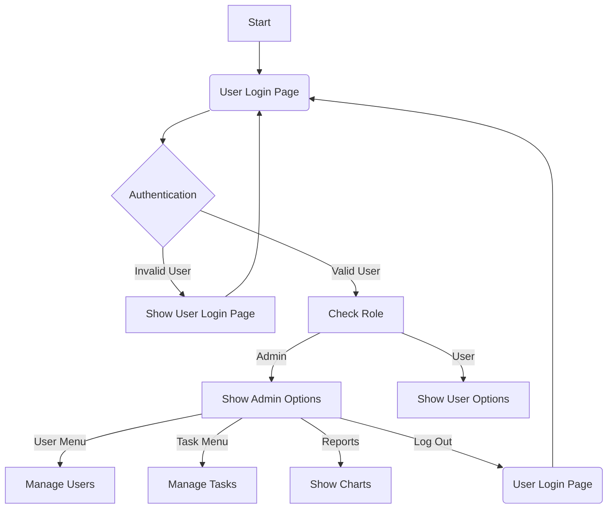

# ws

## Application Flow Diagram:

```mermaid
graph TD
    A[Start] --> B(User Login Page)
    B --> C{Authentication}
    C -->|Invalid User| D[Show User Login Page]
    D --> B(User Login Page)
    C -->|Valid User| E[Check Role]
    E -->|Admin| F[Show Admin Options]
    F -->|User Menu| G[Manage Users ]
    F -->|Task Menu| H[Manage Tasks ]
    F -->|Reports| I[Show Charts ]
    F -->|Log Out| J(User Login Page)
    J --> B(User Login Page)
    E -->|User| Z[Show User Options]    
```
